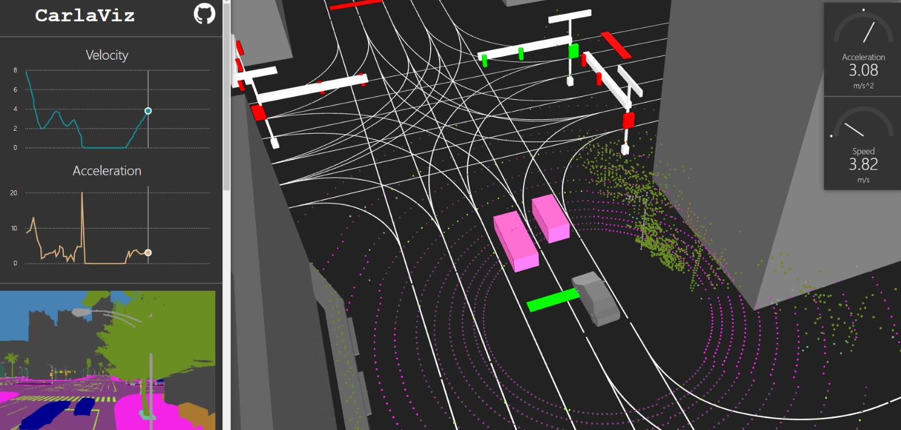

# CarlaViz  

Visualize carla in the web browser.



## Version Supported
| Platform | Supported Carla Version | Docker/Source |
| ------------- | --------------------- | --- |
| Ubuntu | 0.9.6 - 0.9.15| Docker image and source |
| Windows | 0.9.9.2 - 0.9.15| Docker image and source |

## Instructions
### Docker image
Docker image is provided. Run following command to pull this image (including frontend and backend).

```bash
# pull the image based on your carla version
docker pull mjxu96/carlaviz:0.9.15
```

### How to run it?
Here is a simple [example](./examples) to run it.

### Build from source
Although the container image is out-of-box to use, you are also welcome to build on your own!

Refer to this [page](./docs/build.md) for building instructions.

## Contribution
Please read [this](./CONTRIBUTION.md).

## Author and Collaboration
[Minjun Xu](https://github.com/mjxu96)   mjxu96@outlook.com

Please contact me via email if you want more collaborations.
