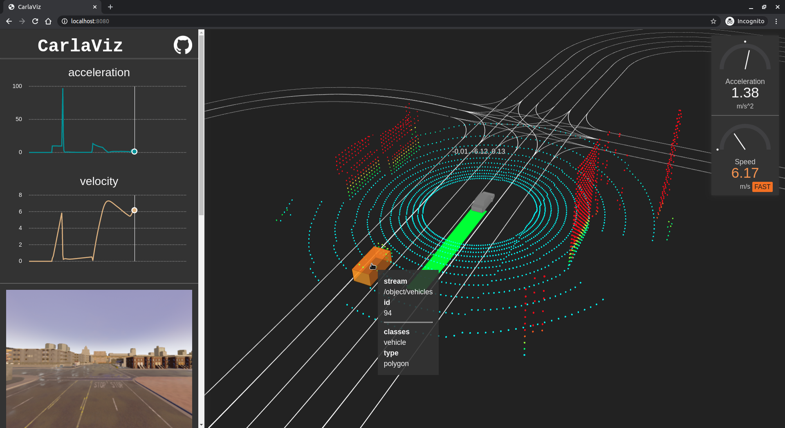

# CarlaViz
Visualize carla in the web browser.

Now support Carla 0.9.6

</img>

## Instructions
### Container image
Container image is provides as [here](). Run following command to pull this image (including frontend and backend).

```bash
# pull the image
docker pull mjxu96/carlaviz:0.9.6
```

### Build from sources
Although the container image is out-of-box to use, you are also welcome to build on your own!

Refer to this [page](./docs/build.md) for building instructions.

### How to run it?
Here is a simple [example]() to run it. This example also includes the [Python API]() to draw extra lines, points and texts in the web browser.

## Third Party Libraries
1. [uber streetscape.gl](https://github.com/uber/streetscape.gl) as frontend
2. [carla](http://carla.org/)
1. [zaphoyd websocketpp](https://github.com/zaphoyd/websocketpp)
2. [chriskohlhoff asio](https://github.com/chriskohlhoff/asio)
3. [mcrodrigues macro-logger](https://github.com/dmcrodrigues/macro-logger)
4. [nlohmann json](https://github.com/nlohmann/json)
5. [jessey-git fx-gltf](https://github.com/jessey-git/fx-gltf)
6. [ReneNyffenegger cpp-base64](https://github.com/ReneNyffenegger/cpp-base64)
7. [boost](https://www.boost.org/)